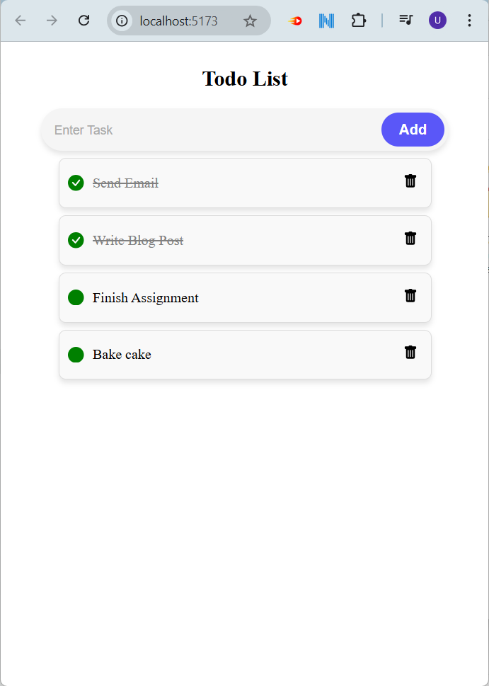
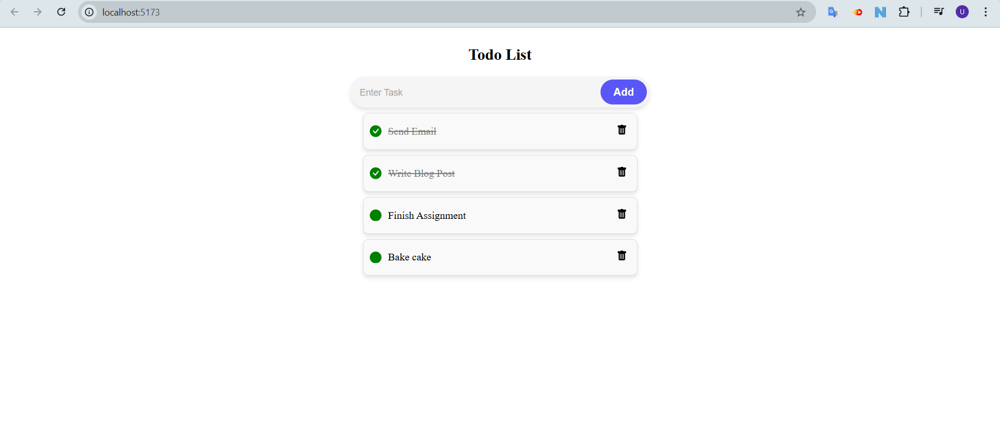

# To-Do List Application

This is a full-stack **To-Do List Application** built using the **MERN Stack** (MongoDB, Express, React, Node.js). The app allows users to add tasks, mark them as completed, and delete tasks. It provides a clean, modern user interface with smooth interactions.

## Features

- **Add Tasks**: Users can add new tasks to the list.
- **Mark as Completed**: Tasks can be marked as completed, which visually changes the style of the task.
- **Delete Tasks**: Users can delete tasks from the list.
- **Database Integration**: Tasks are stored and retrieved from a MongoDB database.
- **Responsive Design**: The application works seamlessly across devices.
- **Interactive UI**: Styled input field and buttons with hover animations.

## Screenshots

### Task Input and List View

### Full-Page View

## Technology Stack

### Frontend
- **React**: Front-end framework for building the user interface.
- **CSS**: Used for styling and hover animations.

### Backend
- **Node.js**: JavaScript runtime for server-side scripting.
- **Express.js**: Framework for building APIs and handling server requests.

### Database
- **MongoDB**: NoSQL database for storing and managing tasks.